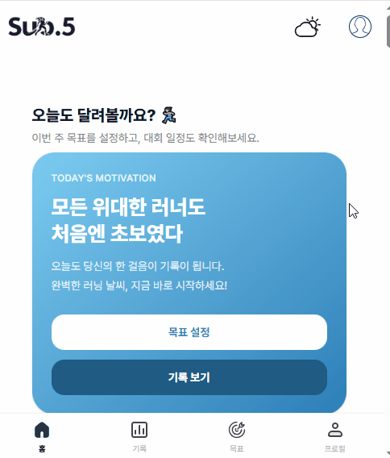
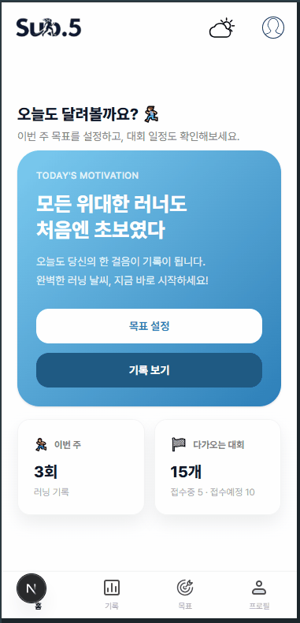
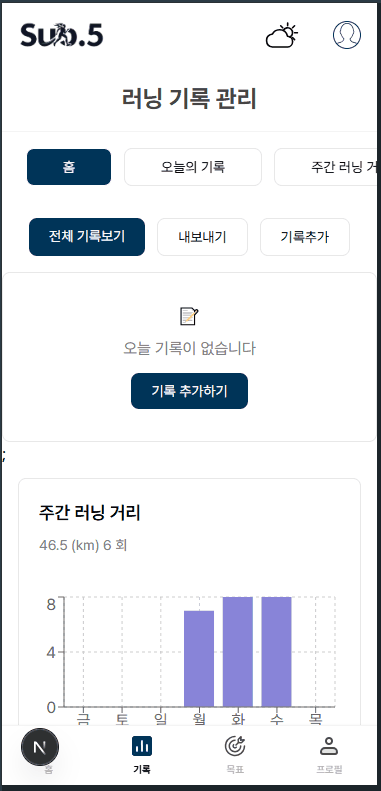
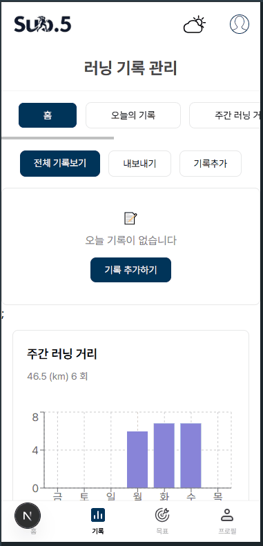
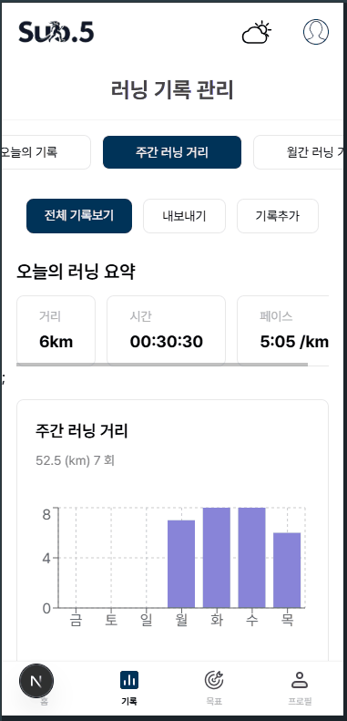
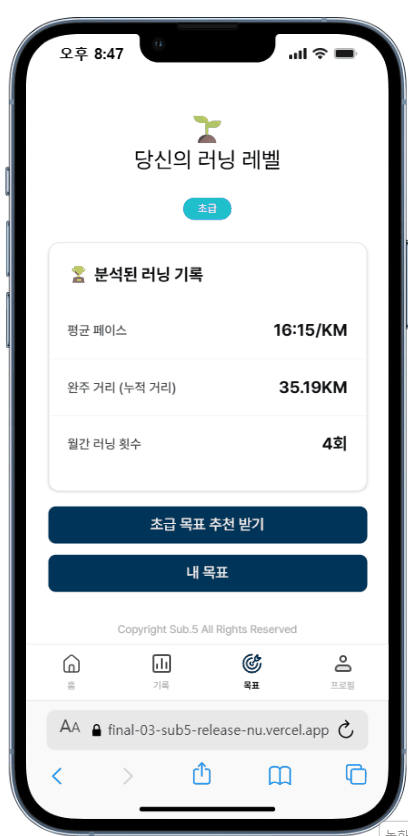
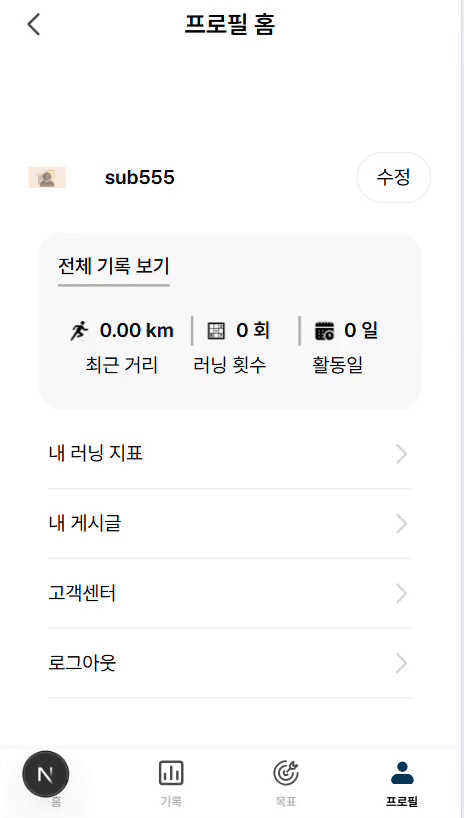

# 🏃‍♂️ Sub.5

**5분대 페이스로 완주하는 그날까지, 함께 달립니다** 🏃

<div align="center"></div>

- [배포 URL 바로가기](https://final-03-sub5-release-three.vercel.app/)
- [WIKI 바로가기](https://github.com/FRONTENDBOOTCAMP-15th/final-03-sub5/wiki)

## 📋 목차

1. [프로젝트 소개](#1️⃣-프로젝트-소개)
2. [팀 소개](#2️⃣-팀-소개)
3. [주요 기능](#3️⃣-주요-기능)
4. [화면 흐름 소개](#4️⃣-화면-흐름-소개)
5. [트러블슈팅](#5️⃣-트러블슈팅)
6. [회고](#6️⃣-회고)

<br/>

## 📆 프로젝트 기간

**2026.01.13 (MON) ~ 2026.02.13 (THU) (약 4주)**

- 2026.01.13 ~ 01.17 : 프로젝트 설정
- 2026.01.20 ~ 01.23 : 디자인 & 문서화
- 2026.01.26 ~ 01.30 : 마크업 & 1차 배포
- 2026.02.02 ~ 02.08 : 기능 구현 & 2차 배포
- 2026.02.09 ~ 02.12 : 디버깅 & 최종 배포
- 2026.02.13 : 최종 발표

<br/>
<br/>

# 1️⃣ 프로젝트 소개

## 💡 프로젝트 이름의 의미

**Sub 5**는 두 가지 의미를 담고 있습니다.

### 1️⃣ 마라톤 용어

km당 5분대의 페이스(5분대)로 달리는 러너를 의미합니다.

### 2️⃣ 의미

마라톤의 엘리트 선수를 포함한 일반선수의 페이스는 평균 5:30 ~ 6:30 사이 입니다.
서로 각자 다른 환경에서 각자의 자리에서 훈련한 그들은 함께 같은 대회에서 노력의 결실을 맺습니다.
저희는 **5명의 팀원**이 마라톤에 참가하는 선수들처럼 각자의 속도로 성장하며 함께 결국 골인한다는 의미를 담았습니다.

빠르지만 느려도 그것은 틀린게 아닌 다른것일뿐.
마라톤처럼 각자의 페이스를 유지하되,  
끝까지 완주하는 것이 저희 팀의 개발 방향입니다.

## 📌 왜 이 프로젝트를 만들었는가?

현재 가장 유행하는 스포츠 중 하나인 러닝 문화.
러닝은 별도의 장비 없이 누구나 쉽게 시작할 수 있는 운동입니다.
하지만 많은 사람들이 막연히 시작했다가
구체적인 목표와 동기 부족으로 빠르게 포기 하기에
그런 사람들도 운동을 시작하고 즐기기 좋은 가이드라인을 제공하고 싶었습니다.

Sub5는 단순한 기록 앱이 아닌,
유저의 러닝 데이터를 시각화하고 분석하여  
자신의 성장을 추적하고, 지속적인 동기를 부여하는 서비스를 목표로 합니다.

## 🔨 기술 스택

### Frontend

[](https://skillicons.dev)

### 상태관리


### Database

[](https://skillicons.dev)

### Version Control

[](https://skillicons.dev)

### CI/CD

[](https://skillicons.dev)

## 🔮 주제

러닝 기록을 기반으로 사용자의 레벨(초급/중급/고급)을 자동 계산하고,  
레벨에 맞는 목표를 추천해주는 러닝 목표 관리 플랫폼

## 2️⃣ 팀 소개

### 👥 팀원 소개

|   이름    |                    👑 박한섭                     |                   방명규                   |                유홍상                |                오지아                |                   류혜진                   |
| :-------: | :----------------------------------------------: | :----------------------------------------: | :----------------------------------: | :----------------------------------: | :----------------------------------------: |
|   역할    |                      🤴 PM                       |                     PL                     |                 발표                 |                디자인                |                    서기                    |
| 개발 분배 |                기록 관리,<br>통합                |             날씨,<br>헤더/네비             |      회원가입,<br>로그인<br>홈       |          프로필,<br>게시판           |                 목표 설정                  |
|  GitHub   | [@LionSeopBong](https://github.com/LionSeopBong) | [@matthewb2](https://github.com/matthewb2) | [@sang-3](https://github.com/sang-3) | [@Jia-Oh](https://github.com/Jia-Oh) | [@HyeJin003](https://github.com/HyeJin003) |

### 🎯 팀 목표

- 매일 데일리 스크럼 진행
- 코드 리뷰 후 머지
- 이슈 기반 브랜치 관리

# 3️⃣ 주요 기능

### 주요 기능 시연 및 설명

|     제목     | 상세설명                                                                        |
| :----------: | :------------------------------------------------------------------------------ |
|     주제     | 이메일 회원가입                                                                 |
| 기능 및 구현 | - 이메일로 회원가입 후 온보딩 진행<br>- 약관 동의 → 프로필 입력 → 신체정보 입력 |

<br>

|     제목     | 상세설명                        |
| :----------: | :------------------------------ |
|     주제     | 소셜 로그인 (카카오/구글)       |
| 기능 및 구현 | - 카카오, 구글 소셜 로그인 지원 |

<br>

|     제목     | 상세설명                                                             |
| :----------: | :------------------------------------------------------------------- |
|     주제     | 홈 화면                                                              |
| 기능 및 구현 | - 오늘의 동기부여 문구 표시<br>- 다가오는 국내/해외 마라톤 대회 정보 |

<br>

|     제목     | 상세설명                                                                                                                                                              |
| :----------: | :-------------------------------------------------------------------------------------------------------------------------------------------------------------------- |
|     주제     | 러닝 기록 관리                                                                                                                                                        |
| 기능 및 구현 | - 러닝 기록 등록 (거리, 시간, 페이스)<br>- 시간,거리 입력시 페이스 자동계산<br>- 오늘의 러닝 요약<br>- 주간,월간 러닝 거리 차트 시각화 <br>- scv 파일로 데이터 Export |

<br>

|     제목     | 상세설명                                                                                                                          |
| :----------: | :-------------------------------------------------------------------------------------------------------------------------------- |
|     주제     | 러닝 레벨 분석                                                                                                                    |
| 기능 및 구현 | - 러닝 기록 기반 레벨 자동 계산 (초급/중급/고급)<br>- 평균 페이스, 누적 거리, 월간 러닝 횟수 분석<br>- 레벨에 맞는 목표 추천 받기 |

<br>

|     제목     | 상세설명                                                                                                                |
| :----------: | :---------------------------------------------------------------------------------------------------------------------- |
|     주제     | 목표 추천                                                                                                               |
| 기능 및 구현 | - 레벨별 맞춤 목표 추천 (5KM ~ 42KM)<br>- 단계별 챌린지 잠금 (Step 1 완료 → Step 2 해제)<br>- 원하는 목표 선택하여 설정 |

<br>

|     제목     | 상세설명                                                                                              |
| :----------: | :---------------------------------------------------------------------------------------------------- |
|     주제     | 내 목표 관리                                                                                          |
| 기능 및 구현 | - 목표 상태 변경 (진행중/완료/미완료)<br>- 실제 러닝 기록 기반 진행률 표시<br>- 목표 삭제 (모달 확인) |

<br>

|     제목     | 상세설명                                                                                    |
| :----------: | :------------------------------------------------------------------------------------------ |
|     주제     | 프로필                                                                                      |
| 기능 및 구현 | - 프로필 수정 (닉네임, 성별, 생년월일)<br>- 내 러닝 지표, 내 게시글<br>- 고객센터, 로그아웃 |

<br>

|     제목     | 상세설명                                                       |
| :----------: | :------------------------------------------------------------- |
|     주제     | 날씨 정보                                                      |
| 기능 및 구현 | - 현재 위치 날씨 정보 페이지 이동<br>- 러닝하기 좋은 날씨 안내 |

### 📂 프로젝트 폴더 구조

```
app/
├── auth/                    # 🔐 로그인/회원가입
│   ├── login/
│   ├── signup/
│   └── SocialCallback/
├── onboarding/              # 📋 온보딩
│   ├── terms/               #    약관 동의
│   ├── profile/             #    프로필 입력
│   └── body/                #    신체정보 입력
├── home/                    # 🏠 홈
├── records/                 #  러닝 기록
│   ├── new/                 #    기록 추가
│   ├── all/                 #    전체 기록
│   └── [_id]/               #    기록 상세/수정
├── goals/                   #  목표 설정
│   ├── components/          #    공통 컴포넌트 (Modal 등)
│   ├── my/components/       #    내 목표 (GoalCard, GoalFilter 등)
│   ├── recommend/components/#    목표 추천 (RecCard, RecButton 등)
│   ├── types/               #    타입 정의
│   └── utils/               #    레벨 계산
├── profile/                 # 👤 프로필
│   ├── home/                #    프로필 홈
│   ├── edit/                #    프로필 수정
│   ├── record/              #    내 러닝 지표
│   ├── board/               #    게시판
│   │   ├── inquiry-board/   #      문의 게시판
│   │   ├── notice/[id]/     #      공지사항 상세
│   │   ├── my/              #      내 글
│   │   ├── create/          #      글 작성
│   │   └── [id]/            #      글 상세 (댓글)
│   └── components/          #    공통 컴포넌트
├── weather/                 #  날씨
│   └── widget/              #    날씨 위젯
│       └── components/
├── components/              #  공통 컴포넌트
│   ├── common/              #    헤더, 네비 등
│   ├── landing/             #    시작 화면
│   └── ui/                  #    UI 컴포넌트
├── lib/                     #  API 및 유틸
│   └── components/          #    유틸 함수
├── action/                  #  서버 액션
└── api/                     #  API 라우트
    ├── auth/                #    인증
    ├── forecast/            #    날씨 예보 (3일/시간/중기/기온)
    ├── weather/             #    현재 날씨
    ├── kakao/search/        #    카카오 장소 검색
    ├── regid/               #    지역 코드
    └── ultraviolet/         #    자외선 지수
```

## 4️⃣ 화면 흐름 소개

<div align="center">

  
  
  <br/><br/>
  
  
  
  <br/><br/>
  
  
</div>

## 5️⃣ 트러블슈팅

|  이름  | 문제                                                                                                                                                                                    | 원인                                                                                                                                                                                                                 | 해결                                                                                                                                                                                                                                |
| :----: | :-------------------------------------------------------------------------------------------------------------------------------------------------------------------------------------- | :------------------------------------------------------------------------------------------------------------------------------------------------------------------------------------------------------------------- | :---------------------------------------------------------------------------------------------------------------------------------------------------------------------------------------------------------------------------------- |
| 류혜진 | 목표 상태 변경 시 `extra`의 다른 데이터가 사라짐                                                                                                                                        | API 요청 시 `extra` 객체 내 특정 필드만 변경하려 했으나, 서버에서 `extra` 객체 전체를 덮어씌우는 구조였음                                                                                                            | 변경 요청 시 기존 `extra` 데이터를 스프레드 연산자로 포함하여 `{ ...currentExtra, 변경필드 }` 형태로 전송                                                                                                                           |
| 박한섭 | • API 스키마 확장 문제<br/>• 기록 추가 시 운동시간 및 거리(distance) 입력에서 소수점 인식 불가<br/>• CSV 파일 추출 시 한글 깨짐<br/>• 추가 컴포넌트 작업 시 중복 함수 및 코드 다수 발생 | • 기본 `posts` 스키마가 러닝 기록에 필요한 데이터를 충분히 제공하지 않음<br/>• `parseInt` 사용으로 정수만 변환됨<br/>• Excel이 BOM 없이 파일을 열 경우 ANSI 인코딩으로 인식함<br/>• 공통 로직이 분산되어 가독성 저하 | • `extra` 객체를 활용해 커스텀 데이터 구조 설계<br/>• `parseFloat` 사용으로 소수점 계산 가능하도록 수정<br/>• UTF-8 BOM(`\uFEFF`) 추가<br/>• 커스텀 훅으로 공통 로직 분리 (코드 약 50% 감소)                                        |
| 오지아 | 상태 관리 타이밍 이슈                                                                                                                                                                   | 업로드/로딩/hydration 시점 제어 부족                                                                                                                                                                                 | 상태 라이프사이클 제어: 임시 state 활용, 타이밍 조정, 마운트 여부 확인                                                                                                                                                              |
| 유홍상 | • 소셜 로그인 시 기존 유저/신규 유저 구분 로직 혼란<br/>• 새로고침 시 로그인 상태 초기화<br/>• Alert가 닫히지 않는 상태 반복 발생                                                       | • 로그인(Login)과 회원가입(Signup)의 개념을 명확히 분리하지 못함<br/>• 인증 정보를 전역 상태(zustand)에만 저장하여 새로고침 시 초기화됨<br/>• `useEffect` 의존성 배열 관리 미흡으로 alert가 재실행됨                 | • 로그인=인증, 회원가입=계정 생성으로 개념 분리 후 플로우 재정의<br/>• 기존 유저 → Home / 신규 유저 → 약관 → 온보딩 → 최종 저장 구조 확립<br/>• 토큰 기반 상태 복원 로직 적용<br/>• `useEffect` 의존성 정리 및 alert 실행 조건 분리 |
| 방명규 | • api 기능 구현 난항                                                                                                                                                                    | • 기본 가이드라인 파악 미흡                                                                                                                                                                                          | •3시간 단기 예보 호출하여 데이터 가공                                                                                                                                                                                               |

## 6️⃣ 회고

|  이름  | 배운 점                                                                                                                                                                                                                                                                                                 | 아쉬운 점                                                                                                                                                                                     |
| :----: | :------------------------------------------------------------------------------------------------------------------------------------------------------------------------------------------------------------------------------------------------------------------------------------------------------ | :-------------------------------------------------------------------------------------------------------------------------------------------------------------------------------------------- |
| 박한섭 | • Custom Hook Pattern으로 코드 50% 감소<br/>• 비즈니스 로직과 UI 로직 분리 경험<br/>• 상태 관리와 의존성 배열의 중요성 체득<br/>• TypeScript 기반 안정적 코드 작성<br/>• RESTful API 설계 및 Server Actions 활용 경험                                                                                   | • 에러 핸들링 및 로딩 상태 관리 미흡<br/>• 차트 알고리즘 최적화 부족<br/>• 단위 테스트 미작성<br/>• 반응형 및 접근성 고려 부족                                                                |
| 방명규 | • Raw 데이터를 가공·변환하는 역량 향상<br/>• 여러 API를 통합하여 하나의 화면 구성 경험<br/>• 불완전한 문서 환경에서의 문제 해결 능력 강화                                                                                                                                                               | • 에러 핸들링 및 로딩 상태 관리 부족<br/>• 캐싱 전략 부재                                                                                                                                     |
| 유홍상 | • 인증 흐름 설계가 UI 구현보다 더 중요하다는 것을 배움<br/>• 로그인 상태 유지(토큰/스토리지/전역 상태)의 차이를 이해함<br/>• 소셜 로그인 분기 처리와 온보딩 단계 관리 경험<br/>• 상태 관리와 `useEffect` 의존성 배열의 중요성 체감<br/>• 실제 서비스에서 발생할 수 있는 인증·상태 복원 이슈를 직접 해결 | • 초기 설계 단계에서 전체 인증 플로우를 다이어그램으로 정리하지 못함<br/>• 전역 상태 전략을 초기에 명확히 세우지 못해 리팩토링 발생<br/>• 예외 케이스(에러/로딩/세션 만료) 처리 보완이 늦어짐 |
| 오지아 | 단일 파라미터 기반 컴포넌트 재사용을 통해 확장성과 유지보수성을 고민할 수 있었다.<br/><br/>권한 및 상태 관리 설계를 직접 적용하며 구조 설계의 중요성을 체감했다.                                                                                                                                        | 캐싱 전략을 활용했다면 성능 개선 가능했을 것.<br/><br/>모달 포커스 관리 및 키보드 접근성 보완 필요                                                                                            |
| 류혜진 | AI를 활용하되 코드 정답을 받지 않고 가이드 기반으로 직접 구현함.<br/><br/>개념 재학습 및 문제 해결 역량 향상                                                                                                                                                                                            | 초기 설계 경험 부족.<br/><br/>다음 프로젝트에서는 먼저 설계 후 AI는 검증 도구로 활용 예정                                                                                                     |
